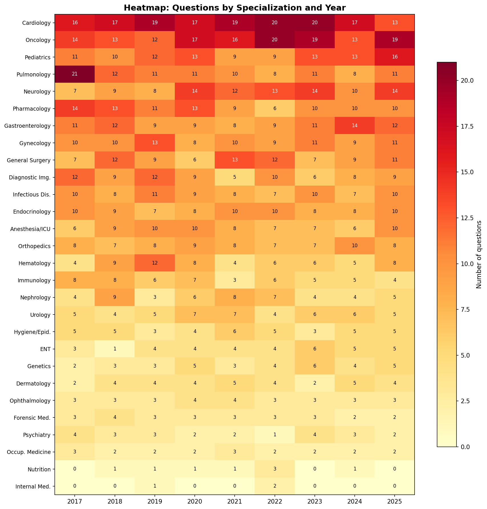
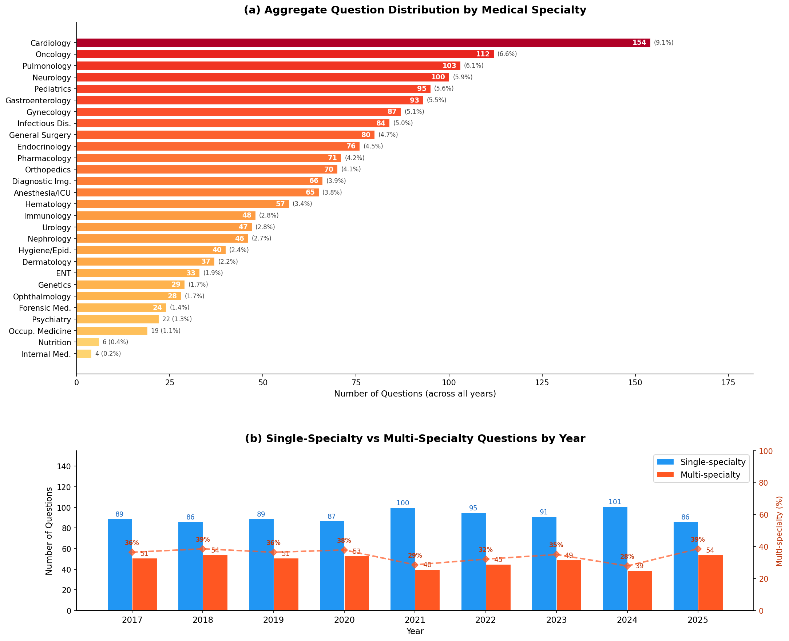

<p align="center">
  <h1 align="center">ITAMed</h1>
  <p align="center">
    <strong>Italian Medical Specialization Exam Dataset (2017–2025)</strong>
  </p>
  <p align="center">
    <a href="https://huggingface.co/datasets/Filo-White/ITAMed"></a>
    <!-- <a href="#citation"></a> -->
    <a href="#license"></a>
  </p>
</p>

---

## Overview

**ITAMed** is a comprehensive, bilingual (Italian/English) dataset of **1,260 multiple-choice medical questions** from the Italian National Medical Specialization Entrance Exam (*Concorso SSM — Scuole di Specializzazione in Medicina*), spanning **9 consecutive years** (2017–2025, 140 questions/year).

Every question is enriched with:
- **Medical specialty classification** across a standardized taxonomy of 28 categories
- **Image metadata** — presence flag, image type (21 categories), and file path to the extracted image
- **Bilingual text** — original Italian + English translation initially drafted by Claude (claude-opus-4-8) and fully reviewed against the Italian source by a senior bilingual physician.

### Quick Start

```python
# Via HuggingFace
from datasets import load_dataset

dataset = load_dataset("Filo-White/ITAMed", split="train")

# Filter by year, specialty, or image presence
cardiology = dataset.filter(lambda x: "Cardiology" in x["category"])
with_images = dataset.filter(lambda x: x["has_image"])
```

---

## Repository Structure

```
ITAMed/
├── Dataset/                              # Final dataset (ready to use)
│   ├── IT/
│   │   ├── xlsx/                         #   Italian XLSX (per-year + complete)
│   │   ├── json/                         #   Italian JSON (per-year + complete)
│   │   └── ITAMed_Distribution_IT.xlsx   #   Category & image distribution (IT)
│   ├── EN/
│   │   ├── xlsx/                         #   English XLSX (per-year + complete)
│   │   ├── json/                         #   English JSON (per-year + complete)
│   │   └── ITAMed_Distribution_EN.xlsx   #   Category & image distribution (EN)
│   └── images/                           #   Extracted question images by year
│
├── Data_Extraction/                      # PDF sources & extraction scripts
│   ├── README.md                         #   Extraction methodology
│   ├── pdf_sources/                      #   Official SSM exam PDFs (2017–2025)
│   └── scripts/                          #   PDF → structured data extractors
│
├── Question_Classification/              # Dual-annotator classification module
│   ├── README.md                         #   Full methodology & results (κ=0.8950)
│   ├── scripts/                          #   Classification & agreement scripts
│   ├── results/                          #   Claude, GPT, and agreement outputs
│   └── expert_review/                    #   Expert adjudication workflow
│
├── Dataset_Translation/                  # Translation module (IT→EN)
│   ├── README.md                         #   Translation methodology & review process
│   ├── scripts/                          #   Translation & review-application scripts
│   ├── translation_corrections.json      #   Structured log of expert corrections
│   └── ITAMed_complete_EN_tracked.xlsx   #   Translation corrections (highlighted)
│
├── Dataset/scripts/                      # Dataset utility scripts
│   └── shuffle_answers.py                #   Answer randomization for benchmarking
│
├── Charts_EN/                            # Distribution visualizations
│   ├── README.md                         #   Chart descriptions
│   ├── scripts/                          #   Generation scripts
│   └── Output/                           #   Generated PNG charts
│
└── README.md                             # This file
```

---

## Dataset Schema

### XLSX Columns

| Field | IT Column | EN Column | Type | Description |
|:------|:----------|:----------|:-----|:------------|
| Year | `Anno` | `Year` | int | Exam year (2017–2025) |
| Question Number | `Numero Domanda` | `Question Number` | int | Position within year (1–140) |
| Question Code | `Codice Domanda` | `Question Code` | str | Official unique identifier |
| Question | `Domanda` | `Question` | str | Clinical vignette + question stem |
| Answer A | `Risposta A` | `Answer A` | str | **Always the correct answer** |
| Answer B–E | `Risposta B–E` | `Answer B–E` | str | Distractor options |
| Correct Answer | `Risposta Corretta` | `Correct Answer` | str | Always `"A"` |
| Category | `Categoria` | `Category` | str | Medical specialty (1–2, semicolon-separated) |
| Question Type | `Tipo Domanda` | `Question Type` | str | `case-based` or `knowledge-based` |
| Image | `Immagine` | `Image` | str | `Si`/`No` (IT) or `Yes`/`No` (EN) |
| Image Category | `Categoria Immagine` | `Image Category` | str | Diagnostic image type |
| Image Path | `Percorso Immagine` | `Image Path` | str | Relative path to image file |

### JSON Structure

Each JSON file contains an array of question objects:

```json
{
  "year": 2020,
  "question_number": 1,
  "question_code": "ssm20203811854",
  "question": "A 25-year-old man presents to his physician...",
  "answer_a": "Livedo reticularis",
  "answer_b": "Raynaud's phenomenon",
  "answer_c": "Perniosis",
  "answer_d": "Erythromelalgia",
  "answer_e": "Vasculitis",
  "correct_answer": "A",
  "category": "Immunology and Rheumatology",
  "question_type": "case-based",
  "has_image": false,
  "image_category": "",
  "image_path": ""
}
```

| Field | Type | Description |
|:------|:-----|:------------|
| `year` | int | Exam year (2017–2025) |
| `question_number` | int | Position within year (1–140) |
| `question_code` | str | Official unique identifier |
| `question` | str | Clinical vignette + question stem |
| `answer_a` | str | **Always the correct answer** (see note below) |
| `answer_b`–`answer_e` | str | Distractor options |
| `correct_answer` | str | Always `"A"` (see note below) |
| `category` | str | Medical specialty (1–2, semicolon-separated) |
| `question_type` | str | `"case-based"` or `"knowledge-based"` |
| `has_image` | bool | Whether the question includes a figure |
| `image_category` | str | Diagnostic image type (empty if no image) |
| `image_path` | str | Relative path to image file (empty if no image) |

> **Note on answer ordering:** In the official PDF release, the correct answer is always in position A. The dataset preserves this format for fidelity. For evaluation and benchmarking purposes, a shuffled version with randomized answer positions is available:
>
> ```bash
> python Dataset/scripts/shuffle_answers.py --seed 42
> ```
>
> This generates `ITAMed_complete_shuffled.json` (and `_EN` variant) with the `correct_answer` field updated to the new position and a `shuffle_mapping` field recording the permutation.

---

## Medical Specialty Categories (28)

<details>
<summary>Click to expand full taxonomy</summary>

| # | Italian | English |
|:-:|:--------|:--------|
| 1 | Anestesia e Rianimazione | Anesthesia and Intensive Care |
| 2 | Cardiologia e Cardiochirurgia | Cardiology and Cardiac Surgery |
| 3 | Chirurgia Generale | General Surgery |
| 4 | Dermatologia e Venereologia | Dermatology and Venereology |
| 5 | Diagnostica per Immagini e Medicina Nucleare | Diagnostic Imaging and Nuclear Medicine |
| 6 | Ematologia | Hematology |
| 7 | Endocrinologia | Endocrinology |
| 8 | Farmacologia e Tossicologia | Pharmacology and Toxicology |
| 9 | Gastroenterologia | Gastroenterology |
| 10 | Genetica Medica | Medical Genetics |
| 11 | Ginecologia e Ostetricia | Gynecology and Obstetrics |
| 12 | Igiene, Epidemiologia e Statistica | Hygiene, Epidemiology and Statistics |
| 13 | Immunologia e Reumatologia | Immunology and Rheumatology |
| 14 | Malattie Infettive | Infectious Diseases |
| 15 | Medicina del Lavoro | Occupational Medicine |
| 16 | Medicina Interna | Internal Medicine |
| 17 | Medicina Legale | Forensic Medicine |
| 18 | Nefrologia | Nephrology |
| 19 | Neurologia e Neurochirurgia | Neurology and Neurosurgery |
| 20 | Nutrizione Clinica | Clinical Nutrition |
| 21 | Oftalmologia | Ophthalmology |
| 22 | Oncologia | Oncology |
| 23 | Ortopedia e Traumatologia | Orthopedics and Traumatology |
| 24 | Otorinolaringoiatria | Otorhinolaryngology |
| 25 | Pediatria | Pediatrics |
| 26 | Pneumologia e Chirurgia Toracica | Pulmonology and Thoracic Surgery |
| 27 | Psichiatria | Psychiatry |
| 28 | Urologia | Urology |

</details>

## Image Categories (21)

<details>
<summary>Click to expand image taxonomy</summary>

| Category | Example Context |
|:---------|:----------------|
| Audiometry report | Otorhinolaryngology hearing assessment |
| Brain CT scan | Neurological emergency imaging |
| Brain MRI | Neurology/neurosurgery diagnostic |
| Chest CT scan | Pulmonary/thoracic evaluation |
| Chest X-ray | Cardiopulmonary assessment |
| Clinical study table | Epidemiology/statistics questions |
| ECG tracing | Cardiology rhythm analysis |
| Endoscopic image | Gastroenterology/pulmonology procedures |
| Forensic photograph | Forensic medicine cases |
| Fundus examination | Ophthalmology retinal assessment |
| Histological image | Pathology tissue analysis |
| Knee arthroscopy image and knee MRI | Orthopedic evaluation |
| Lower limb X-ray | Orthopedic/traumatology assessment |
| Otoscopic image | Otorhinolaryngology ear examination |
| Pelvic X-ray | Orthopedic/gynecological imaging |
| Peripheral blood smear | Hematology microscopy |
| Photograph of a skin lesion | Dermatology clinical assessment |
| Radiological image | General diagnostic imaging |
| Spine MRI | Neurosurgery/orthopedic evaluation |
| Spirometry report | Pulmonology functional testing |
| Upper limb X-ray | Orthopedic/traumatology assessment |

</details>

---

## Key Statistics

| Metric | Value |
|:-------|------:|
| Total questions | 1,260 |
| Years covered | 2017–2025 (9 years) |
| Questions per year | 140 |
| Questions with images | 76 (6.0%) |
| Medical specialty categories | 28 |
| Image categories | 21 |
| Languages | Italian (original) + English (translated) |

### Specialty Distribution

<p align="center">
  
</p>

<p align="center">
  
</p>

> All distribution charts are available in [`Charts_EN/`](Charts_EN/README.md).

---

## Data Source

Questions were extracted from the official PDF documents of the Italian National Medical Specialization Entrance Exam (*Concorso per l'ammissione alle Scuole di Specializzazione in Medicina e Chirurgia*), administered annually by the Italian Ministry of University and Research (MUR).

**Key characteristics:**
- **2017–2019**: Scenario-based format — questions grouped under shared clinical scenarios
- **2020–2025**: Standalone format — each question self-contained
- **All years**: Correct answer always in position A (official release format)

---

## Reproducibility

Each module has its own README with detailed methodology:
[`Data_Extraction/`](Data_Extraction/README.md) · [`Question_Classification/`](Question_Classification/README.md) · [`Dataset_Translation/`](Dataset_Translation/README.md)

```bash
# 1. Extract questions from official PDFs (see Data_Extraction/)
python Data_Extraction/scripts/extract_ssm_scenario.py     # 2017–2019
python Data_Extraction/scripts/extract_ssm_standalone.py   # 2020–2025

# 2. Classify by medical specialty (see Question_Classification/)
export ANTHROPIC_API_KEY="sk-ant-..."
python Question_Classification/scripts/classify_claude.py

export OPENAI_API_KEY="sk-..."
python Question_Classification/scripts/classify_gpt.py

# 3. Inter-rater agreement (Cohen's κ, contingency table, discordance list)
python Question_Classification/scripts/compute_agreement.py

# 4. Expert review → apply adjudicated categories
python Question_Classification/scripts/apply_expert_review.py

# 5. Translate to English (see Dataset_Translation/)
python Dataset_Translation/scripts/translate_questions.py

# 6. Apply expert translation review
python Dataset_Translation/scripts/apply_translation_review.py
```

### Requirements

```
pdfplumber
openpyxl
anthropic>=0.42
openai>=1.0
pandas>=2.0
scikit-learn>=1.0
```

---

<!-- ## Related Work

| Project | Description |
|:--------|:------------|
| [LLM-EVAL-Education](https://github.com/LM-Healthcare/LLM-EVAL-Education) | Benchmarking LLMs on SSM 2020–2024 (closed, open, quantized) |
| [AURORA](https://github.com/LM-Healthcare/AURORA) | On-premise clinical assistant for structured remote anamnesis |
| [LLM_DEMENTIA](https://github.com/LM-Healthcare/LLM_DEMENTIA) | LLM-based dementia diagnosis with incremental clinical evidence |

--- -->

<!-- ## Citation

If you use this dataset, please cite:

```bibtex
@article{itamed2025,
  title   = {ITAMed: A Comprehensive Bilingual Dataset of Italian Medical Specialization Exam Questions (2017--2025)},
  author  = {[Authors]},
  journal = {Scientific Data},
  year    = {2025},
  doi     = {[to be assigned]}
}
```

--- -->

## License

This dataset is released under the **Creative Commons Attribution 4.0 International License (CC BY 4.0)**.

Copyright (c) 2026 Filippo Bianchini, Edoardo Bianchini, Emiliano Bianchini, Massimo Marano, Massimo Mecella, Nicolas Vuillerme.

- **Data** (dataset, translations, annotations, documentation): CC BY 4.0
- **Original exam questions**: public domain under Article 5, Italian Law 633/1941 (official acts of the State)

You are free to share and adapt the material for any purpose, even commercially, as long as you give appropriate credit.

Full license text: https://creativecommons.org/licenses/by/4.0/legalcode

---

## Contact

- **GitHub**: [@Filo-White](https://github.com/Filo-White)
- **HuggingFace**: [Filo-White](https://huggingface.co/Filo-White)
